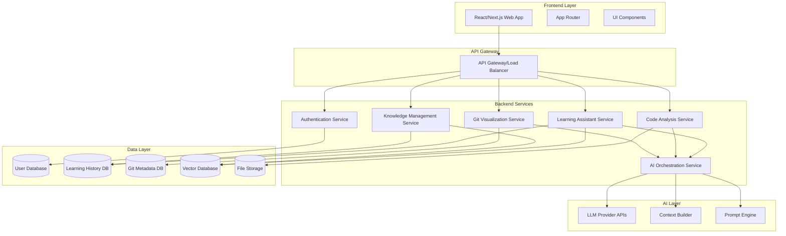

# Design Document: AI-Powered Learning & Developer Productivity Web Platform

## Overview

The AI-Powered Learning & Developer Productivity Web Platform is a comprehensive web application that combines intelligent tutoring, code analysis, Git workflow visualization, and knowledge management. The platform's architecture follows a modern microservices approach with a React/Next.js frontend, Node.js backend services, and AI orchestration layer.

The key innovation is the read-only cross-branch visibility feature that enables safe collaboration by allowing users to explore different Git branches without risk of accidental modifications. This feature addresses a critical gap in existing Git tools where developers often hesitate to explore unfamiliar branches due to fear of making unintended changes.

## Architecture

### High-Level Architecture



### Technology Stack

**Frontend:**
- **Framework:** Next.js 14+ with App Router for server-side rendering and optimal performance
- **UI Library:** React 18+ with TypeScript for type safety
- **Styling:** Tailwind CSS for responsive design and component styling
- **State Management:** Zustand for lightweight state management
- **Git Visualization:** @gitgraph/react for interactive branch graphs
- **Code Editor:** Monaco Editor for syntax highlighting and code display

**Backend:**
- **Runtime:** Node.js with Express.js for API services
- **Language:** TypeScript for type safety across the stack
- **API Design:** RESTful APIs with OpenAPI specification
- **Authentication:** JWT tokens with refresh token rotation
- **File Processing:** Multer for file uploads, with virus scanning

**AI Integration:**
- **LLM Provider:** OpenAI GPT-4 or Anthropic Claude for primary AI capabilities
- **Context Management:** Custom RAG implementation with vector similarity search
- **Prompt Engineering:** Template-based prompt system with context injection
- **Response Streaming:** Server-sent events for real-time AI responses

**Data Storage:**
- **Primary Database:** PostgreSQL for user data, learning history, and Git metadata
- **Vector Database:** Pinecone or Weaviate for semantic search and context retrieval
- **File Storage:** AWS S3 or compatible object storage for uploaded files
- **Caching:** Redis for session management and response caching

## Components and Interfaces

### Frontend Components

#### Core Layout Components
- **AppLayout:** Main application shell with navigation and user context
- **NavigationBar:** Primary navigation with feature access and user menu
- **Sidebar:** Contextual navigation for active features
- **StatusBar:** System status, loading indicators, and notifications

#### Learning Assistant Components
- **ChatInterface:** Main conversation interface with message history
- **MessageBubble:** Individual message display with formatting and actions
- **TopicSelector:** Interface for selecting learning topics and difficulty levels
- **ProgressTracker:** Visual progress indicators and learning analytics
- **LearningDashboard:** Overview of learning journey and achievements

#### Code Analysis Components
- **CodeUploader:** Drag-and-drop interface for code file uploads
- **CodeViewer:** Syntax-highlighted code display with line numbers
- **ExplanationPanel:** Side panel showing line-by-line explanations
- **SuggestionCard:** Cards displaying optimization suggestions and best practices
- **LanguageSelector:** Dropdown for selecting programming language context

#### Git Visualization Components
- **GitGraph:** Interactive branch visualization using @gitgraph/react
- **CommitDetails:** Detailed view of individual commits with metadata
- **BranchSelector:** Interface for switching between repository branches
- **DiffViewer:** Side-by-side comparison of code changes
- **ConflictResolver:** Guided interface for resolving merge conflicts

#### Read-Only Branch Viewer Components
- **BranchExplorer:** Tree view of repository structure in read-only mode
- **ReadOnlyEditor:** Code viewer with clear read-only indicators
- **BranchComparator:** Interface for comparing multiple branches
- **SafetyIndicator:** Visual indicators showing read-only status
- **PermissionGate:** Component that enforces read-only restrictions

#### Knowledge Management Components
- **HistoryBrowser:** Searchable interface for past conversations
- **BookmarkManager:** Organization system for saved explanations
- **SearchInterface:** Full-text search across learning history
- **ExportTools:** Data export functionality for user content

### Backend Service Interfaces

#### Authentication Service API
```typescript
interface AuthService {
  register(userData: UserRegistration): Promise<AuthResponse>
  login(credentials: LoginCredentials): Promise<AuthResponse>
  refreshToken(refreshToken: string): Promise<TokenResponse>
  logout(userId: string): Promise<void>
  resetPassword(email: string): Promise<void>
  verifyEmail(token: string): Promise<void>
}
```

#### Learning Assistant Service API
```typescript
interface LearningService {
  startConversation(userId: string, topic: string): Promise<ConversationId>
  sendMessage(conversationId: string, message: string): Promise<AIResponse>
  getConversationHistory(conversationId: string): Promise<Message[]>
  updateDifficulty(conversationId: string, level: DifficultyLevel): Promise<void>
  getProgress(userId: string): Promise<LearningProgress>
}
```

#### Code Analysis Service API
```typescript
interface CodeAnalysisService {
  analyzeCode(code: string, language: string): Promise<CodeAnalysis>
  uploadFile(file: File, userId: string): Promise<FileAnalysis>
  explainLines(codeId: string, lineRange: LineRange): Promise<Explanation>
  getSuggestions(codeId: string): Promise<Suggestion[]>
  getSupportedLanguages(): Promise<Language[]>
}
```

#### Git Visualization Service API
```typescript
interface GitService {
  connectRepository(repoUrl: string, credentials: GitCredentials): Promise<Repository>
  getBranchGraph(repoId: string): Promise<GitGraph>
  getCommitDetails(repoId: string, commitHash: string): Promise<CommitDetails>
  getBranchList(repoId: string): Promise<Branch[]>
  compareBranches(repoId: string, baseBranch: string, compareBranch: string): Promise<BranchComparison>
  getReadOnlyContent(repoId: string, branch: string, path: string): Promise<FileContent>
}
```

#### AI Orchestration Service API
```typescript
interface AIService {
  generateResponse(prompt: string, context: Context): Promise<AIResponse>
  buildContext(userId: string, query: string): Promise<Context>
  streamResponse(prompt: string, context: Context): AsyncIterable<ResponseChunk>
  analyzeCode(code: string, analysisType: AnalysisType): Promise<CodeInsights>
  explainGitOperation(operation: GitOperation): Promise<Explanation>
}
```

## Data Models

### User and Authentication Models
```typescript
interface User {
  id: string
  email: string
  username: string
  passwordHash: string
  emailVerified: boolean
  createdAt: Date
  updatedAt: Date
  preferences: UserPreferences
}

interface UserPreferences {
  theme: 'light' | 'dark'
  defaultDifficulty: DifficultyLevel
  preferredLanguages: string[]
  notificationSettings: NotificationSettings
}

interface Session {
  id: string
  userId: string
  token: string
  refreshToken: string
  expiresAt: Date
  createdAt: Date
}
```

### Learning and Knowledge Models
```typescript
interface Conversation {
  id: string
  userId: string
  topic: string
  difficulty: DifficultyLevel
  messages: Message[]
  createdAt: Date
  updatedAt: Date
  status: 'active' | 'completed' | 'archived'
}

interface Message {
  id: string
  conversationId: string
  role: 'user' | 'assistant'
  content: string
  timestamp: Date
  metadata: MessageMetadata
}

interface LearningProgress {
  userId: string
  topicsStudied: TopicProgress[]
  totalSessions: number
  totalTimeSpent: number
  achievements: Achievement[]
  knowledgeGraph: KnowledgeNode[]
}

interface Bookmark {
  id: string
  userId: string
  conversationId: string
  messageId: string
  title: string
  tags: string[]
  createdAt: Date
}
```

### Code Analysis Models
```typescript
interface CodeAnalysis {
  id: string
  userId: string
  code: string
  language: string
  lineExplanations: LineExplanation[]
  blockExplanations: BlockExplanation[]
  suggestions: Suggestion[]
  complexity: ComplexityMetrics
  createdAt: Date
}

interface LineExplanation {
  lineNumber: number
  explanation: string
  complexity: 'low' | 'medium' | 'high'
  concepts: string[]
}

interface Suggestion {
  type: 'optimization' | 'best-practice' | 'security' | 'readability'
  severity: 'info' | 'warning' | 'error'
  description: string
  suggestedFix: string
  lineRange: LineRange
}
```

### Git and Repository Models
```typescript
interface Repository {
  id: string
  userId: string
  name: string
  url: string
  branches: Branch[]
  lastSync: Date
  accessLevel: 'read-only' | 'read-write'
}

interface Branch {
  name: string
  commitHash: string
  lastCommit: Commit
  isProtected: boolean
  ahead: number
  behind: number
}

interface Commit {
  hash: string
  message: string
  author: Author
  timestamp: Date
  changes: FileChange[]
  parents: string[]
}

interface FileContent {
  path: string
  content: string
  language: string
  readOnly: boolean
  lastModified: Date
  author: Author
}
```

### AI and Context Models
```typescript
interface Context {
  userId: string
  conversationHistory: Message[]
  codeContext: CodeContext[]
  learningProfile: LearningProfile
  relevantKnowledge: KnowledgeChunk[]
}

interface AIResponse {
  content: string
  confidence: number
  sources: Source[]
  suggestedFollowUps: string[]
  processingTime: number
}

interface KnowledgeChunk {
  id: string
  content: string
  source: string
  relevanceScore: number
  embedding: number[]
  metadata: ChunkMetadata
}
```

Now I need to use the prework tool to analyze the acceptance criteria before writing the Correctness Properties section.

<function_calls>
<invoke name="prework">
<parameter name="featureName">ai-learning-platform

## Correctness Properties

*A property is a characteristic or behavior that should hold true across all valid executions of a system—essentially, a formal statement about what the system should do. Properties serve as the bridge between human-readable specifications and machine-verifiable correctness guarantees.*

Based on the prework analysis of acceptance criteria, the following properties ensure the system behaves correctly across all valid inputs and scenarios:

### Learning Assistant Properties

**Property 1: Adaptive Explanation Generation**
*For any* learning topic and user skill level, the Learning Assistant should generate explanations that are appropriately complex for the specified skill level and contain step-by-step breakdowns
**Validates: Requirements 1.1, 1.2**

**Property 2: Learning Session Persistence**
*For any* completed learning interaction, the system should automatically store the session data with accurate timestamps and make it retrievable in the user's learning history
**Validates: Requirements 1.3**

**Property 3: Context Continuity**
*For any* conversation sequence, the Learning Assistant should maintain context across interactions and reference previous knowledge when returning to topics
**Validates: Requirements 1.4, 1.6**

**Property 4: Progress Analytics Accuracy**
*For any* set of learning activities, the system should calculate progress metrics, topic coverage, and time spent accurately based on the actual interaction data
**Validates: Requirements 1.5**

### Code Analysis Properties

**Property 5: Multi-Language Code Processing**
*For any* valid code input in supported languages (JavaScript, Python, Java, TypeScript), the Code Analyzer should successfully parse the structure and provide appropriate analysis
**Validates: Requirements 2.1, 2.5**

**Property 6: Complexity-Based Explanation**
*For any* code with varying complexity levels, the system should provide line-by-line explanations for complex sections and block-level explanations for logical groupings
**Validates: Requirements 2.2, 2.3**

**Property 7: Code Quality Analysis**
*For any* code containing improvement opportunities or errors, the system should identify issues and provide actionable suggestions with appropriate severity levels
**Validates: Requirements 2.4, 2.6**

### Git Visualization Properties

**Property 8: Repository Visualization Completeness**
*For any* connected Git repository, the system should render an accurate interactive graph showing all branches, commits, and their relationships
**Validates: Requirements 3.1**

**Property 9: Git Information Display**
*For any* Git operation or commit, the system should display complete metadata (messages, timestamps, authorship) and provide contextual AI explanations when requested
**Validates: Requirements 3.2, 3.5, 3.6**

**Property 10: Git Operation Guidance**
*For any* merge scenario or conflict situation, the system should provide step-by-step explanations and resolution guidance appropriate to the specific Git operation
**Validates: Requirements 3.3, 3.4**

### Read-Only Branch Viewer Properties

**Property 11: Read-Only Enforcement**
*For any* branch viewing operation, the system should display all content in read-only mode with clear visual indicators and prevent any edit operations with appropriate user feedback
**Validates: Requirements 4.1, 4.4, 4.6**

**Property 12: Cross-Branch Comparison**
*For any* branch comparison, the system should accurately highlight code differences with color-coded changes and provide AI explanations of the modifications
**Validates: Requirements 4.2, 4.5**

**Property 13: File Metadata Display**
*For any* file in any branch, the system should display complete commit history, authorship information, and timestamps accurately
**Validates: Requirements 4.3**

### Knowledge Management Properties

**Property 14: Learning History Search**
*For any* search query against learning history, the system should return relevant past conversations and explanations ranked by relevance
**Validates: Requirements 5.2**

**Property 15: Content Organization**
*For any* learning content or bookmarks, the system should organize items by topics, dates, and learning paths in a consistent and retrievable manner
**Validates: Requirements 5.3, 5.5**

**Property 16: Analytics Dashboard Accuracy**
*For any* user's learning activities, the dashboard should display accurate progress metrics, identify knowledge gaps, and suggest appropriate learning paths
**Validates: Requirements 5.4, 5.6**

### Authentication Properties

**Property 17: Secure Account Management**
*For any* user registration or password reset operation, the system should create secure accounts with proper email verification and token validation
**Validates: Requirements 6.1, 6.4**

**Property 18: Session Management**
*For any* user login or session activity, the system should establish secure sessions, load user preferences, and maintain sessions across browser refreshes and short disconnections
**Validates: Requirements 6.2, 6.6**

**Property 19: Session Expiration Handling**
*For any* expired session, the system should prompt for re-authentication without losing current work and validate profile updates securely
**Validates: Requirements 6.3, 6.5**

### AI Engine Properties

**Property 20: Context-Aware Response Generation**
*For any* user query, the AI Engine should maintain conversation context, adapt to user skill level, and integrate relevant learning history when generating responses
**Validates: Requirements 7.1, 7.2, 7.3**

**Property 21: Context Management**
*For any* conversation that exceeds context limits, the AI Engine should intelligently summarize and maintain relevant information without losing critical context
**Validates: Requirements 7.5**

**Property 22: Source Citation**
*For any* AI-generated response, the system should include appropriate source citations and additional learning resources when relevant to the query
**Validates: Requirements 7.6**

### User Interface Properties

**Property 23: Responsive Design**
*For any* screen size or device type, the user interface should adapt appropriately to mobile, tablet, and desktop layouts while maintaining functionality
**Validates: Requirements 8.2**

**Property 24: Navigation Consistency**
*For any* feature navigation, the system should provide clear navigation paths, breadcrumbs, and maintain consistent user experience patterns
**Validates: Requirements 8.3**

**Property 25: Accessibility and Interaction**
*For any* user interaction, the system should support keyboard shortcuts, provide syntax highlighting for code, zoom capabilities, and accessibility compliance
**Validates: Requirements 8.4, 8.5**

**Property 26: Error Handling**
*For any* error condition, the system should display helpful error messages with suggested actions and maintain system stability
**Validates: Requirements 8.6**

### Storage System Properties

**Property 27: Data Persistence Integrity**
*For any* user-generated content or learning session, the system should persist data reliably with automatic backups and maintain file integrity with version history
**Validates: Requirements 9.1, 9.2**

**Property 28: Upload Validation**
*For any* file upload operation, the system should validate file types, enforce size limits, and handle uploads securely
**Validates: Requirements 9.3**

**Property 29: Data Security**
*For any* sensitive user data, the system should apply encryption both at rest and in transit, and ensure zero data loss during backup operations
**Validates: Requirements 9.4, 9.5**

**Property 30: Data Portability**
*For any* user data export request, the system should provide complete and correctly formatted data that maintains user data portability
**Validates: Requirements 9.6**

## Error Handling

### Error Categories and Strategies

**Authentication Errors:**
- Invalid credentials: Clear error messages without revealing account existence
- Session expiration: Graceful re-authentication prompts with work preservation
- Email verification failures: Resend options with rate limiting

**AI Processing Errors:**
- LLM API failures: Fallback to cached responses or alternative providers
- Context overflow: Intelligent summarization with user notification
- Rate limiting: Queue management with user feedback on wait times

**Code Analysis Errors:**
- Unsupported file types: Clear messaging with supported format list
- Parse failures: Partial analysis with error highlighting
- Large file handling: Chunked processing with progress indicators

**Git Integration Errors:**
- Repository access failures: Clear authentication and permission guidance
- Network connectivity issues: Retry mechanisms with exponential backoff
- Malformed repository data: Graceful degradation with partial functionality

**Data Storage Errors:**
- Database connection failures: Automatic retry with user notification
- File upload failures: Resume capability and clear error messaging
- Backup failures: Alert systems with manual backup options

### Error Recovery Mechanisms

**Automatic Recovery:**
- Connection retry with exponential backoff
- Fallback to cached data when services are unavailable
- Graceful degradation of non-critical features

**User-Initiated Recovery:**
- Manual retry buttons for failed operations
- Data export options before attempting fixes
- Clear instructions for resolving common issues

**System Monitoring:**
- Real-time error tracking and alerting
- Performance monitoring with automatic scaling
- Health checks for all critical services

## Testing Strategy

### Dual Testing Approach

The platform requires both unit testing and property-based testing to ensure comprehensive coverage:

**Unit Tests** focus on:
- Specific examples and edge cases
- Integration points between components
- Error conditions and boundary cases
- UI component behavior and rendering

**Property Tests** focus on:
- Universal properties that hold for all inputs
- Comprehensive input coverage through randomization
- System behavior across different scenarios
- Data integrity and consistency

### Property-Based Testing Configuration

**Testing Framework:** Fast-check for JavaScript/TypeScript property-based testing
**Test Configuration:**
- Minimum 100 iterations per property test
- Each property test references its design document property
- Tag format: **Feature: ai-learning-platform, Property {number}: {property_text}**

**Example Property Test Structure:**
```typescript
describe('Learning Assistant Properties', () => {
  it('should generate appropriate explanations for any topic and skill level', () => {
    fc.assert(fc.property(
      fc.string({ minLength: 1 }), // topic
      fc.constantFrom('beginner', 'intermediate', 'advanced'), // skill level
      async (topic, skillLevel) => {
        const response = await learningAssistant.generateExplanation(topic, skillLevel);
        
        // Property assertions
        expect(response.content).toBeDefined();
        expect(response.complexity).toBe(skillLevel);
        expect(response.steps).toHaveLength.greaterThan(0);
        expect(response.appropriateForLevel).toBe(true);
      }
    ), { numRuns: 100 });
  });
  // Tag: Feature: ai-learning-platform, Property 1: Adaptive Explanation Generation
});
```

### Integration Testing

**API Integration Tests:**
- End-to-end workflows across service boundaries
- Authentication and authorization flows
- Data consistency across services

**UI Integration Tests:**
- User journey testing with Playwright or Cypress
- Cross-browser compatibility testing
- Responsive design validation

**AI Integration Tests:**
- LLM provider failover testing
- Context management validation
- Response quality assessment

### Performance Testing

**Load Testing:**
- Concurrent user simulation
- API endpoint performance under load
- Database query optimization validation

**Stress Testing:**
- System behavior under extreme conditions
- Memory usage and garbage collection
- Resource exhaustion scenarios

**Monitoring and Observability:**
- Application performance monitoring (APM)
- Real-time error tracking
- User experience monitoring